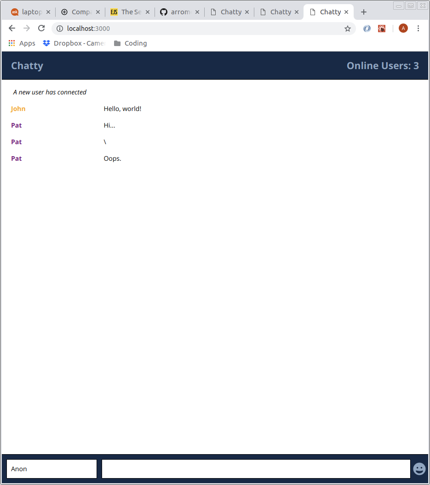
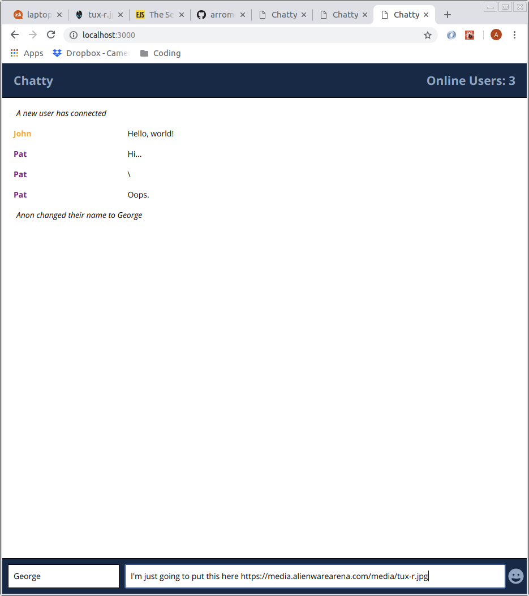
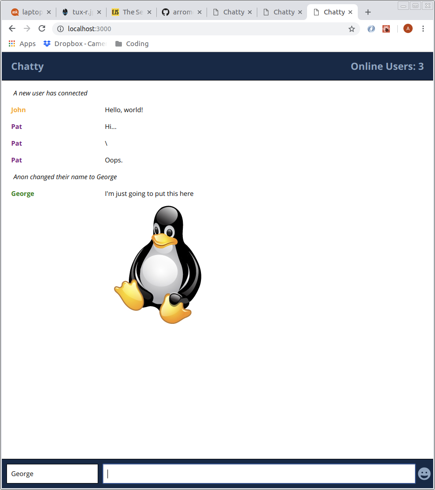
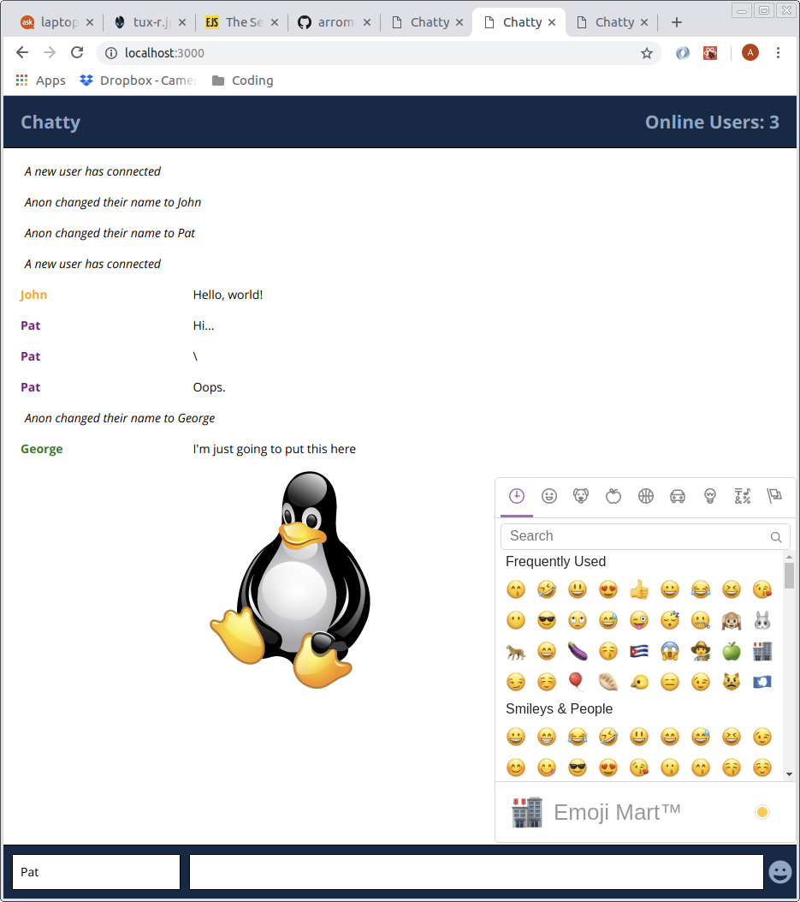
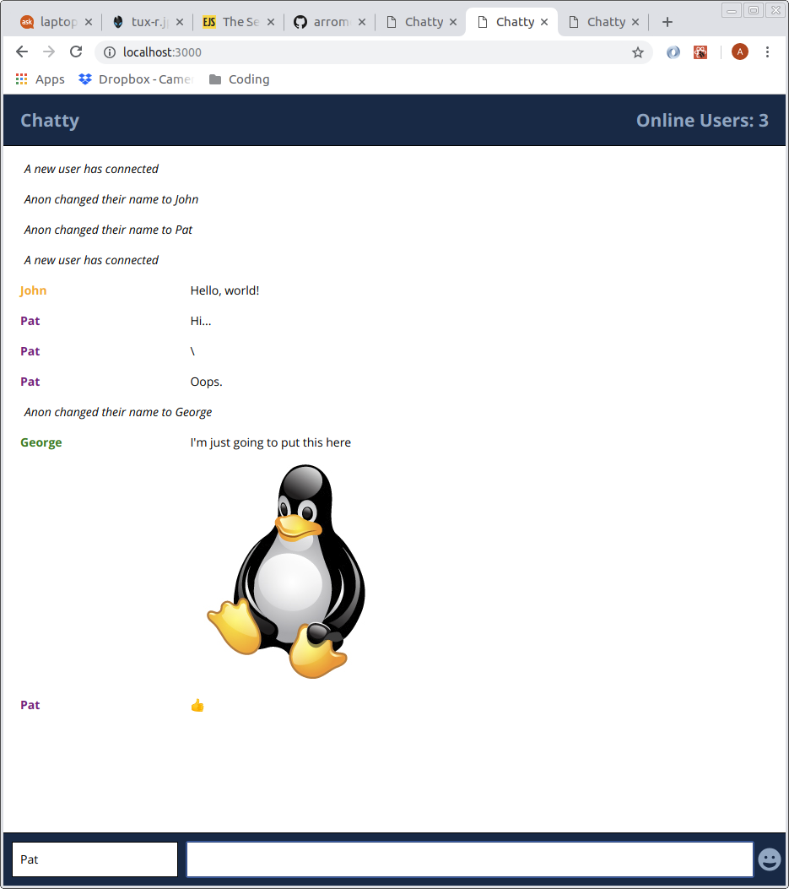

Chatty
=====================

A simple chat app built using React and WebSockets.

### Usage

- Clone this repo
- In the newly created folder run `npm install`
- Start the WebSocket server `npm start ./chatty_server/server.js`
- Start the web server `npm start`
- In a browser navigate to `localhost:3000`
- To test, create a new window or tab and navigate to the same URL
- Enjoy

### Features

Chatty allows for live conversation with other clients currently connected to the server: 

Allows for name changes: 

Pulls image URLs out of messages and renders them in the chat: 

Includes an emoji picker: 

### Roadmap

There are a number of features currently in the Chatty development pipeline:

- Turn non-image URLS into clickable links
- Setup media queries to make for better mobile rendering
- Name picker before connecting to server
- Preventing duplicate names (adds number to end)
- Name color picker
- List currently connected users
- Option to change color of messages

### Dependencies

* React
* Webpack
* ws (WebSockets)
* react-fontawesome
* emoji-mart
* [babel-loader](https://github.com/babel/babel-loader)
* [webpack-dev-server](https://github.com/webpack/webpack-dev-server)
